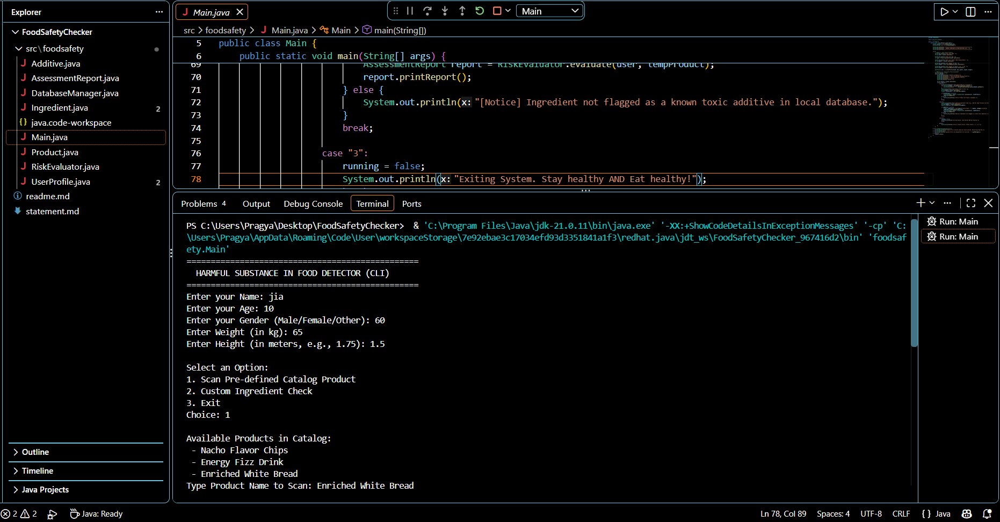
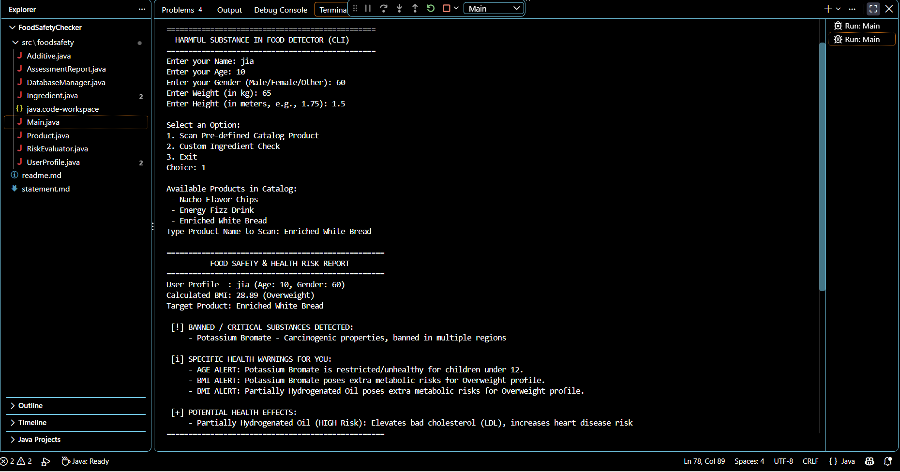
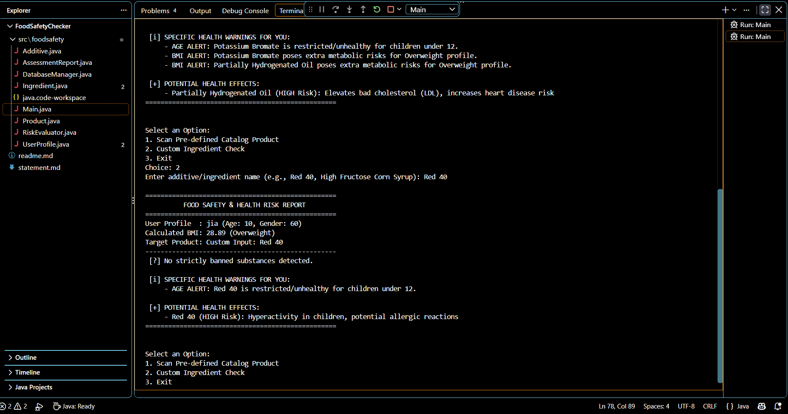

# Harmful Substance in Food Detector (Java CLI)

A modular, object-oriented Java application designed to detect harmful food additives, flagged chemical compounds, and banned substances in consumer food products while providing personalized health risk reports based on age, gender,and BMI metrics.

---

<b>📌 Project Overview & Objectives</b>

 

Modern processed foods contain numerous additives, preservatives, and artificial colorings. This application cross references product ingredient lists with local chemical databases and user metrics(Age,Gender, Weight, Height) to output actionable metabolic warnings and toxicity alerts..

<b>✨ Key Features</b>

 

* **BMI & Profile Analysis:** Automatically calculates Body Mass Index (BMI) and assigns health profile categories (*Underweight*, *Normal*, *Overweight*, *Obese*).
* **Additive Toxicity Database:** Stores risk levels (`LOW`, `MEDIUM`, `HIGH`,`BANNED`) and body impact data for common additives.
* **Targeted Safety Rules:** Triggers specific warnings for children (Age <12) and high BMI profiles.
* **Product Catalog & Custom Search:** Enables scanning of pre-defined multi-ingredient packaged goods or ad-hoc custom ingredient evaluation.

<b>🛠️ Technologies & Tools Used</b>

 

* **Programming Language:** Java (JDK 8+)
* **Development Environment:** Visual Studio Code
* **Architecture Design:** Object-Oriented Programming(OOP) & Clean Architecture
* **Interface:** Command Line Interface (CLI)
* **Version Control:** Git & GitHub

<b>🚀 Steps to Install & Run the Project</b>

 

### Prerequisites
* Java Development Kit (JDK 8 or higher) installed.
* Visual Studio Code or any standard Java IDE.

### Execution Steps
1. Clone or download the project repository.
2. Open terminal in the project root folder `FoodSafetyChecker`.
3. Compile the Java files:

   javac -d bin src/foodsafety/*.java

### Run the application:

   java -cp bin foodsafety.Main

<b>🧪 Instructions for Testing</b>

 
### Test Case 1: Pre-defined Product Scan (Age & BMI Risk Warnings)

Launch the program and enter the following test profile:,

Name: John Doe

Age: 10

Gender: Male

Weight (kg): 65

Height (m): 1.5 (Triggers Overweight BMI profile)

Select Option 1 (Scan Pre-defined Catalog Product).

Enter Product Name: Energy Fizz Drink.

Expected Output:

Calculated BMI: 28.89 (Overweight).

[!] Age Alert: Red 40 flagged as restricted for children under 12.

[!] BMI Alert: High Fructose Corn Syrup flagged for high BMI profiles.

Test Case 2: Custom Ingredient Check (Banned Substance Alert)
Select Option 2 (Custom Ingredient Check) from the main menu.

Enter Ingredient Name: Potassium Bromate.

Expected Output:

Flags substance immediately under [!] BANNED / CRITICAL SUBSTANCES DETECTED with carcinogenic warning.

<b>📁 Project Folder Structure</b>

 

### Project Folder Structure

Repository Root)
├── src/
│   └── foodsafety/
│       ├── Additive.java
│       ├── AssessmentReport.java
│       ├── DatabaseManager.java
│       ├── Ingredient.java
│       ├── Main.java
│       ├── Product.java
│       ├── RiskEvaluator.java
│       └── UserProfile.java
├── output1.png
├── output2.png
├── output3.png
├── README.md
└── statement.md

### Output Screenshots

